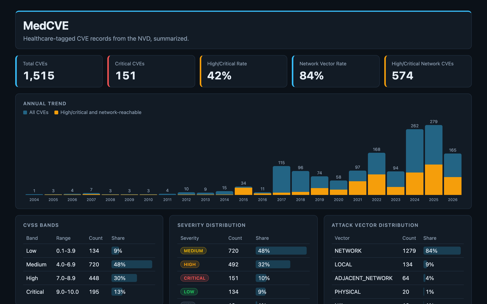
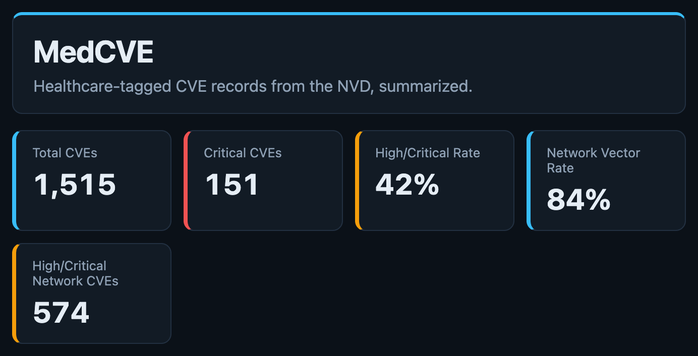
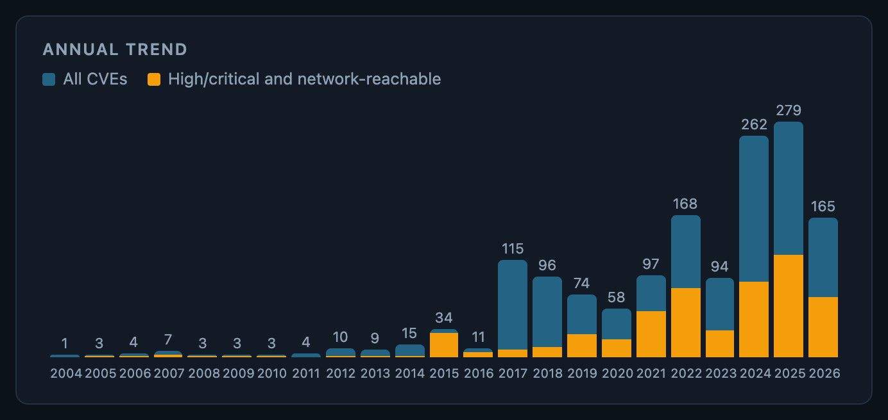
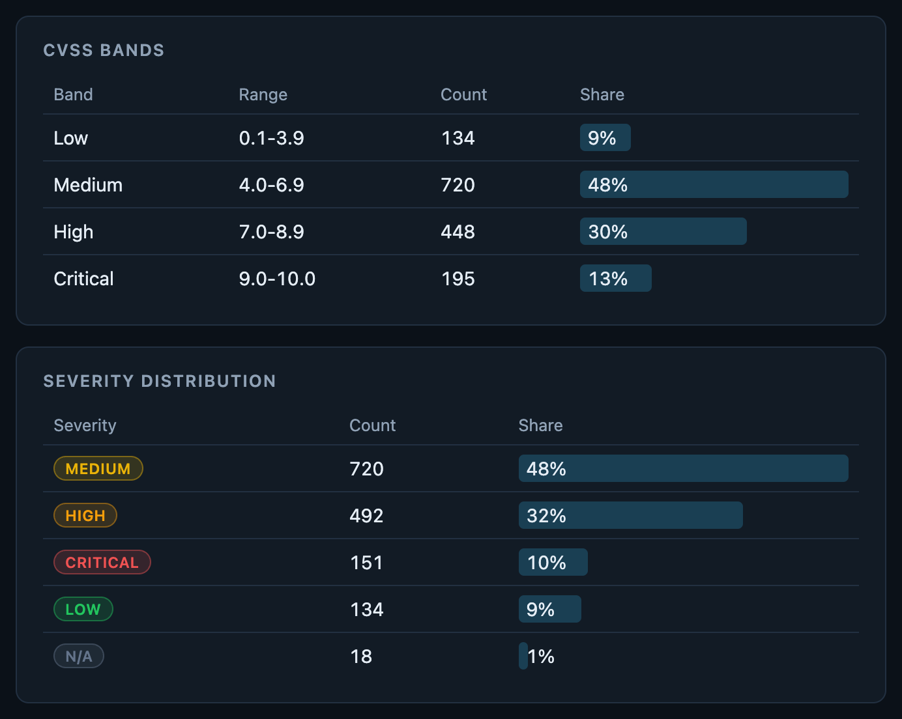
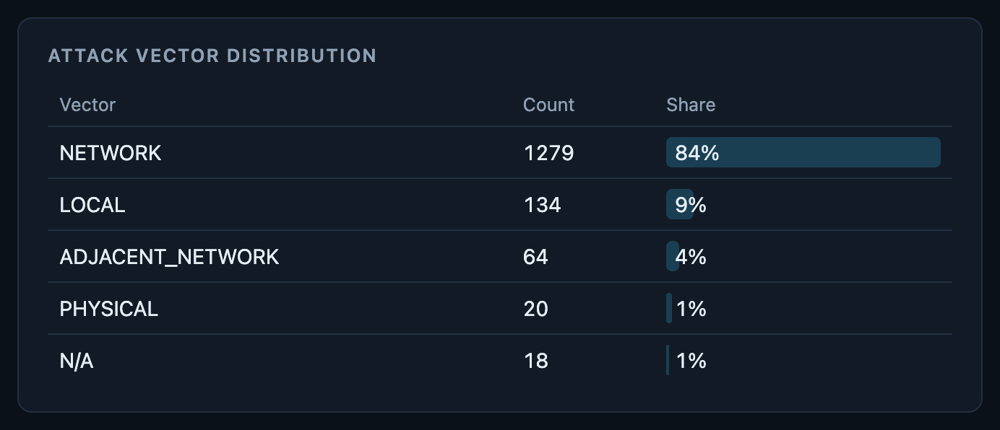
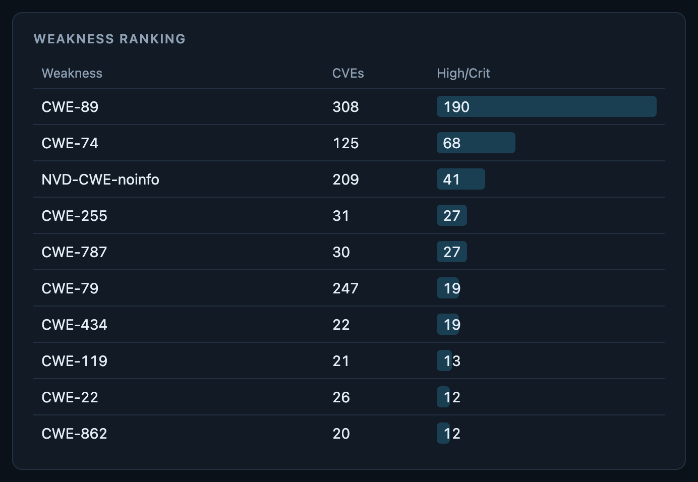
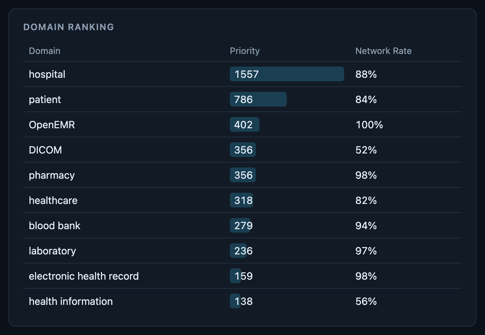
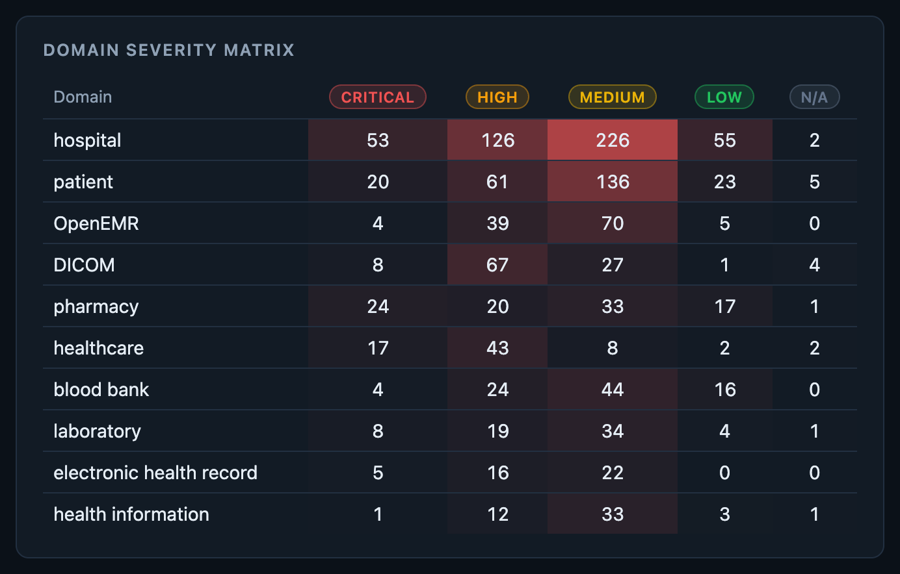
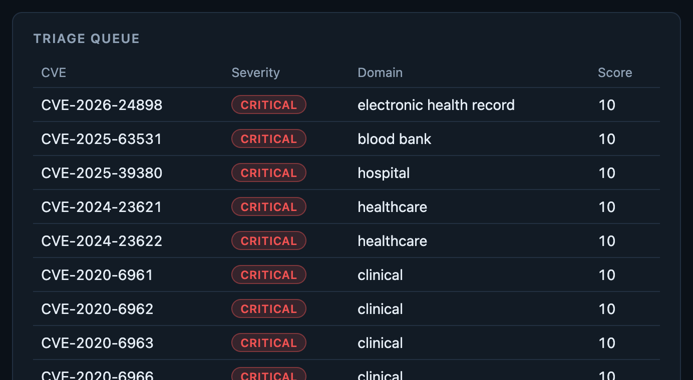

<h1 align="center">MedCVE</h1>

<p align="center">
  <a href="https://github.com/HeyItWorked/MedCVE/actions/workflows/ci.yml"></a>
  
  
  
  
</p>

<p align="center">
  <strong>What 1,515 healthcare CVEs say, on one static page.</strong><br/>
  A pandas analysis of public vulnerability records tagged to hospitals, EHRs, DICOM, pharmacies, and labs — exported to JSON and shown in a dashboard with no build step.
</p>

<h3 align="center"><a href="https://heyitworked.github.io/MedCVE/"><ins>Open the live dashboard</ins></a></h3>

<p align="center">
  
</p>

## What's on the Dashboard

<table>
<tr>
<td width="50%" valign="middle">

### The Headline Numbers

1,515 CVEs, 151 of them critical. 42% are high or critical, 84% are reachable over the network, and 574 are both — the ones that matter most.

</td>
<td width="50%">
  
</td>
</tr>
<tr>
<td width="50%" valign="middle">

### Year by Year

Published CVEs per year from 2004 to 2026, with the high/critical network-reachable share stacked in orange. Volume jumps from 11 in 2016 to 115 in 2017 and peaks at 279 in 2025.

</td>
<td width="50%">
  
</td>
</tr>
<tr>
<td width="50%" valign="middle">

### Severity, Two Ways

The NVD severity label next to fixed CVSS score bands. Nearly half the records are medium; one in ten is critical.

</td>
<td width="50%">
  
</td>
</tr>
<tr>
<td width="50%" valign="middle">

### How They're Reached

Attack vectors across the dataset. Network access dominates, with local, adjacent-network, and physical vectors making up the rest.

</td>
<td width="50%">
  
</td>
</tr>
<tr>
<td width="50%" valign="middle">

### What Breaks

Weaknesses ranked by how many high and critical records they account for. SQL injection (CWE-89) leads by a wide margin, ahead of general injection (CWE-74).

</td>
<td width="50%">
  
</td>
</tr>
<tr>
<td width="50%" valign="middle">

### Where It Hits

Healthcare domains ranked by a priority score that weighs severity, network reach, and CVSS. Records tagged "hospital" lead, followed by "patient", OpenEMR, and DICOM.

</td>
<td width="50%">
  
</td>
</tr>
<tr>
<td width="50%" valign="middle">

### Domain × Severity

A heatmap of the top ten domains by severity, so you can see *where* the critical and high findings cluster, not just how many there are.

</td>
<td width="50%">
  
</td>
</tr>
<tr>
<td width="50%" valign="middle">

### A Triage Queue

The fifteen records that rise to the top of a review queue when severity, network reach, and CVSS score are combined.

</td>
<td width="50%">
  
</td>
</tr>
</table>

**Also in the box:**

- **No rows dropped** — every count and share uses all 1,515 records, missing values included.
- **Exports pinned by tests** — `pytest` rebuilds all nine JSON files from the raw CSV and fails if a committed export drifts.
- **Strict JSON** — no `NaN` ever reaches the browser; nulls export as `null`.
- **No build step** — one HTML file, one stylesheet, and plain JavaScript that reads `data/processed/`.
- **Works on a phone** — panels stack, and the trend chart opens on the most recent years.
- **A written analysis** — the notebook walks through the questions, cleaning, metric definitions, and plots.

---

## Built With

<p>
  <a href="https://www.python.org"><kbd> Python</kbd></a> &nbsp;
  <a href="https://pandas.pydata.org"><kbd> pandas</kbd></a> &nbsp;
  <a href="https://numpy.org"><kbd> NumPy</kbd></a> &nbsp;
  <a href="https://matplotlib.org"><kbd> Matplotlib</kbd></a> &nbsp;
  <a href="https://seaborn.pydata.org"><kbd> seaborn</kbd></a> &nbsp;
  <a href="https://jupyter.org"><kbd> Jupyter</kbd></a> &nbsp;
  <a href="https://pytest.org"><kbd> pytest</kbd></a> &nbsp;
  <a href="https://docs.astral.sh/ruff/"><kbd> Ruff</kbd></a> &nbsp;
  <a href="https://pages.github.com"><kbd> GitHub Pages</kbd></a>
</p>

---

## Quick Start

**View the dashboard** — no install needed; the page reads the committed exports:

```bash
git clone https://github.com/HeyItWorked/MedCVE.git && cd MedCVE
python3 -m http.server 8000     # then open http://localhost:8000/
```

**Run the analysis and tests** — needs Python 3.12:

```bash
python3 -m venv .venv && source .venv/bin/activate
pip install -r requirements-dev.txt
pytest
```

<details>
<summary><strong>How the pieces fit</strong></summary>

<br/>

- `analysis/metrics.py` holds each metric as a plain function: KPIs, annual trend, distributions, CVSS bands, rankings, the domain × severity matrix, and the triage queue.
- `notebooks/healthcare_cve_analysis.ipynb` imports those functions, adds the plots and write-up, and exports the nine JSON files to `data/processed/`. Open it with `jupyter lab` and run all cells to regenerate them.
- `index.html`, `src/app.js`, and `src/styles.css` render the exports. GitHub Pages serves the repo root.
- `tests/` checks the builders against a small synthetic CSV and checks the committed exports against the raw data. CI runs Ruff and pytest on pushes to `main` and on pull requests.

</details>

---

## Reading the Numbers

- **The two scores are ordering heuristics, not security scores.** Domain priority adds severity points (critical 4, high 3, medium 2, low 1), +1 for a network vector, and +1 for CVSS ≥ 9, summed across a domain's records. The triage score uses critical 5, high 4, medium 2, low 1, +2 for network, +2 for CVSS ≥ 9, and +1 for CVSS ≥ 7, for a maximum of 10. Neither measures security or patient risk.
- **Missing values stay in.** pandas reads an empty field and the string `N/A` as the same missing value, and those records appear as `N/A` rows instead of disappearing.
- **CVSS bands can add up to less than 100%.** A score of exactly 0.0, or a missing score, falls in no band.

## Data

`data/raw/healthcare_cybersecurity_10k.csv` comes from the [Healthcare Cybersecurity Vulnerabilities Dataset](https://www.kaggle.com/datasets/chuneeb/healthcare-cybersecurity-vulnerabilities-dataset), published on Kaggle by Uneeb Zulfiqar under [CC0 1.0](https://creativecommons.org/publicdomain/zero/1.0/) and derived from the [NIST National Vulnerability Database](https://nvd.nist.gov/). Despite `10k` in the upstream filename, the only published version has 1,515 records. It is public CVE data, not patient records.

## License

The code is under the [MIT License](LICENSE). The dataset stays under its upstream CC0 1.0 terms.
