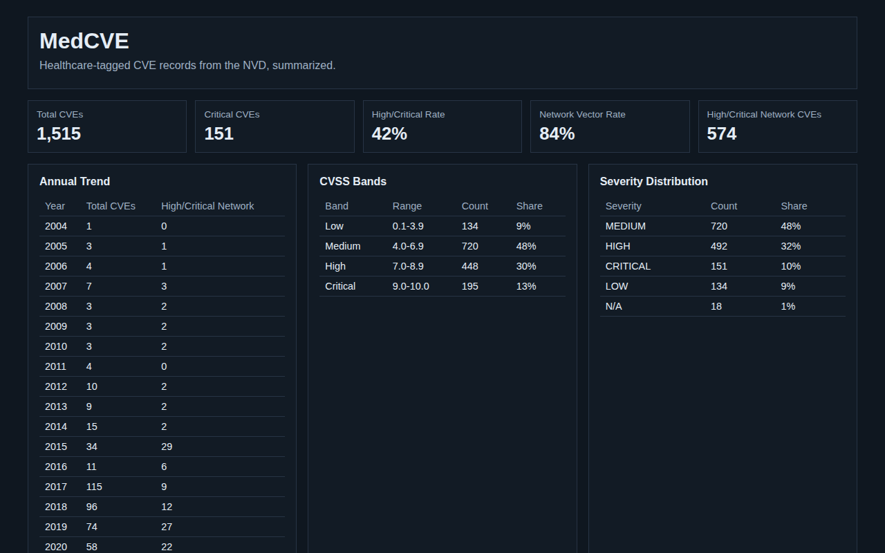

# MedCVE

**Analyze healthcare-tagged CVE records and inspect the results in a static dashboard**

A pandas analysis turns 1,515 public CVE records into nine JSON files, and a small HTML page shows them as KPI cards and tables.



Live: <https://heyitworked.github.io/MedCVE/>

## Run the dashboard

```bash
git clone https://github.com/HeyItWorked/MedCVE.git && cd MedCVE
python3 -m http.server 8000
```

Open <http://localhost:8000/>. The page reads the committed files in `data/processed/`, so no install is needed.

## Run the analysis

Needs Python 3.12.

```bash
python3 -m venv .venv
source .venv/bin/activate
pip install -r requirements-dev.txt
pytest
```

`analysis/metrics.py` holds the metric builders as plain functions. The notebook in `notebooks/` imports them, adds the plots and the write-up, and exports the nine JSON files. `pytest` checks the builders on a small synthetic CSV and checks that the committed exports still match what the raw data produces.

## Notes

- No rows are dropped. Counts and shares use all 1,515 records, including ones with missing values; pandas reads an empty field and the string `N/A` as the same missing value.
- The domain priority score and the triage score are ordering heuristics with hand-picked weights, not security scores.
- CVSS scores of exactly 0.0 and missing scores fall in no band, so the band shares can add up to less than 100%.

## Data

`data/raw/healthcare_cybersecurity_10k.csv` comes from the [Healthcare Cybersecurity Vulnerabilities Dataset](https://www.kaggle.com/datasets/chuneeb/healthcare-cybersecurity-vulnerabilities-dataset), published on Kaggle by Uneeb Zulfiqar under [CC0 1.0](https://creativecommons.org/publicdomain/zero/1.0/), derived from the [NIST National Vulnerability Database](https://nvd.nist.gov/). Despite `10k` in the upstream filename, the only published version has 1,515 records. It is public CVE data, not patient records.

## License

The code is under the [MIT License](LICENSE). The dataset stays under its upstream CC0 1.0 terms.
